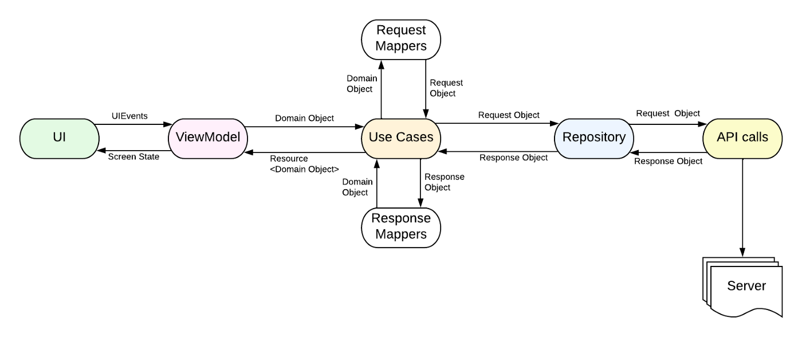

# About Dota 2

All you want to know about dota in one app

## Tech-stack

* Tech-stack
  * [100% Kotlin](https://kotlinlang.org/) + [Coroutines](https://kotlinlang.org/docs/reference/coroutines-overview.html)
  * [Retrofit](https://square.github.io/retrofit/)
  * [Dagger2](https://dagger.dev/)
  * [Compose](https://developer.android.com/jetpack/compose)
  * [Room](https://developer.android.com/topic/libraries/architecture/room)
  * [ViewModel](https://developer.android.com/topic/libraries/architecture/viewmodel)
  * [Data Binding](https://developer.android.com/topic/libraries/data-binding)
  * [InstantApp](https://developer.android.com/topic/google-play-instant)
  * [GitHub Actions](https://github.com/features/actions)
* Testing
    * [Unit Tests](https://en.wikipedia.org/wiki/Unit_testing) ([JUnit 4](https://junit.org/junit4/)
    * [UT Tests](https://en.wikipedia.org/wiki/Graphical_user_interface_testing) ([Espresso](https://developer.android.com/training/testing/espresso))
    * [Truth](https://truth.dev/)
* Gradle
    * [Gradle Kotlin DSL](https://docs.gradle.org/current/userguide/kotlin_dsl.html)
    * [Versions catalog](https://docs.gradle.org/7.0-milestone-1/userguide/platforms.html)
    * Custom tasks

## Architecture

### Module types and module dependencies

This diagram presents dependencies between project modules (Gradle sub-projects).

We have three kinds of modules in the application:

- `app` module that contains code that wires multiple modules together.
- `core/*` modules that some of the features could depend on.
- `feature/*` modules that containing all code related to a given feature.

### Data flow

## Getting started with Android Studio

1. `Android Studio` -> `File` -> `New` -> `From Version control` -> `Git`
2. Enter `https://github.com/i30mb1/AD2.git` into URL field an press `Clone` button