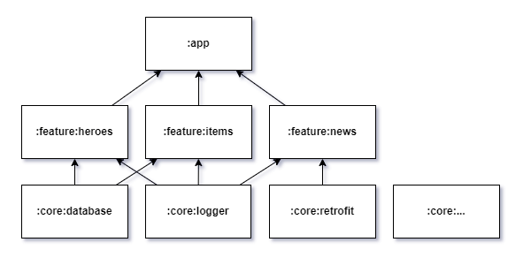
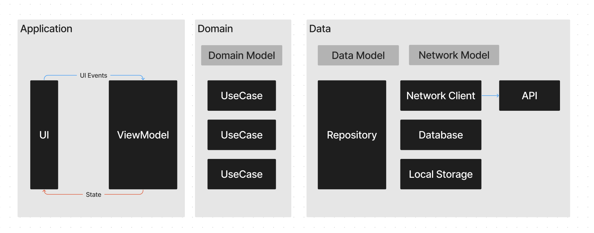

# About Dota 2
![Downloads badge][downloads badge]  ![Ratings badge][ratings badge]

All you want to know about dota in one app

## Tech-stack

* Tech-stack
    * [Kotlin](https://kotlinlang.org/) + [Coroutines](https://kotlinlang.org/docs/reference/coroutines-overview.html)
    * [Dagger2](https://dagger.dev/)
    * [Compose](https://developer.android.com/jetpack/compose)
    * [Room](https://developer.android.com/topic/libraries/architecture/room)
* Testing
    * [Unit Tests](https://en.wikipedia.org/wiki/Unit_testing) ([JUnit 4](https://junit.org/junit4/)
    * [UT Tests](https://en.wikipedia.org/wiki/Graphical_user_interface_testing) ([Espresso](https://developer.android.com/training/testing/espresso))
    * [Truth](https://truth.dev/)

## Architecture

### Module types and module dependencies

This diagram presents dependencies between project modules (Gradle sub-projects).

We have three levels of modules in the application:

- `app` level that builds an application and wires multiple modules together
- `feature/*` level that containing business features (ui, business logic)
- `core/*` level that provide common components to the application

## Clean Architecture

В рамках проекта придерживаемся чистой архитерктуры. Данный подход в рамках многомодульности выражается в виде разделения слоев на модули на
уровне `feature/*`:
- `ui модули` содержать presentation слой (MVVM/MVP/MVI)
- `domain модули` содержат бизнес слой и data слой. Data слой остается закрытым (internal)

## Directory structure

    ├── app                # Mobile app
    ├── build-logic        # Kotlin DSL scripts for project
    ├── features
    │   ├── drawer         # Main screen with draggable view where place all other features
    │   ├── games          # Mini games that relate to dota2
    │   ├── hero-page      # Page with information of selected hero
    │   ├── heroes         # List with all available hero
    │   ├── item-page      # Page with information of selected item
    │   ├── items          # List with all available items
    │   ├── news           # Latest news about dota2
    │   ├── settings       # Application settings for user
    │   ├── streams        # List with live streams from Twitch.tv
    │   └── tournaments    # List with future dota2 tournaments 
    ├── core
    │   ├── common         # Shared Kotlin code
    │   ├── android        # Shared Android code
    │   ├── database       # Application database
    │   ├── app-preference # Application Preferences
    │   ├── coroutines     # Coroutines
    │   ├── dagger         # Dagger
    │   ├── media-player   # MediaPlayer
    │   ├── retrofit       # Retrofit
    │   ├── media-player   # MediaPlayer 
    │   ├── update-manager # Google In-app-update
    │   ├── ktx            # Extensions for android modules
    │   ├── logger         # Custom logger for app
    │   ├── navigator      # Module that allows feature modules communicate with other feature modules without direct dependency
    │   ├── repositories   # All repositories
    │   ├── rules          # Custom lint rules for project
    │   ├── span-parser    # Custom html->Spannable library to simpilify using spans in prepared text
    │   ├── ui             # Common UI elements for all features
    │   └── parser         # Hero/Items/Response parser that creates .json files for the app

### Data flow

## Getting started with Android Studio

1. `Android Studio` -> `File` -> `New` -> `From Version control` -> `Git`
2. Enter `https://github.com/i30mb1/AD2.git` into URL field an press `Clone` button

[downloads badge]: https://PlayBadges.pavi2410.me/badge/downloads?id=n7.ad2
[ratings badge]: https://PlayBadges.pavi2410.me/badge/ratings?id=n7.ad2
